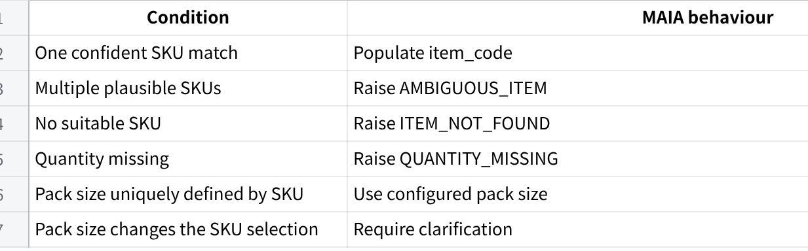
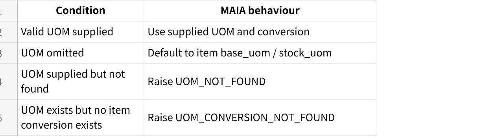
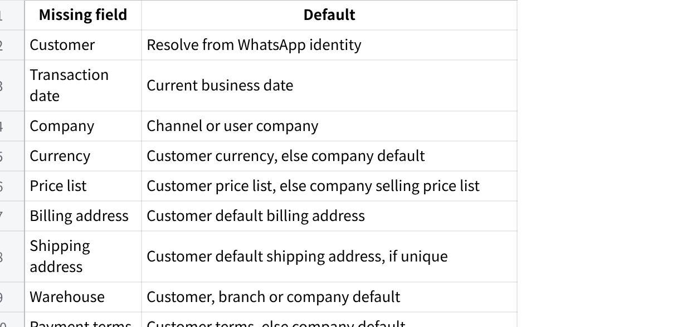

**Frozen-Meat WhatsApp Orders --- MAIA Actions and User-Gap Handling**

**MAIA Frozen-Meat WhatsApp Order Intake Specification**

**1. Purpose**

This document defines how MAIA should convert imperfect Malaysian WhatsApp orders into a Quotation or Sales Order draft.

MAIA should:

Extract and structure information it can resolve.

Apply deterministic defaults for missing information.

Capture customer instructions in the correct document fields.

Surface unresolved, invalid or operationally unverified information to the salesperson.

Prevent submission only when a blocking gap remains.

MAIA should not repeatedly ask for information already available from customer, item, pricing or company records.

**2. Core Resolution Rules**

**Item matching**

**点击图片可查看完整电子表格**

**UOM**

**点击图片可查看完整电子表格**

MAIA may normalise aliases before validation:

ctn → Carton

pkt, pack → Packet

kg, kgs → Kg

pcs, pc → Nos

An explicit invalid UOM must not be silently replaced with the base UOM.

**Pricing**

When no price is stated, MAIA should resolve the item rate using:

Valid customer-specific price.

Standard selling price.

Raise PRICE_NOT_FOUND if neither exists.

The resolution must consider:

Customer.

Item.

UOM.

Quantity tier.

Currency.

Transaction date.

Requests such as "same price" or "best price" do not override the resolved rate. MAIA should populate the current system price and surface the requested price review to the salesperson.

**Header defaults**

**点击图片可查看完整电子表格**

Multiple equally valid addresses, warehouses or customer identities should raise a selection exception.

**3. Remarks Placement**

Use item-level additional_remarks when the instruction applies to one product:

Weight or portion range.

Leaner or lower-fat request.

Lower-bone requirement.

Packaging colour.

Vacuum packing.

Custom cutting.

Minimum shelf life.

Substitution restriction.

Use header-level remarks when the instruction applies to the whole order:

Delivery deadline.

Event date.

Halal-only requirement.

New-address warning.

General substitution rule.

Order-wide compliance requirement.

Where relevant, capture the instruction at both levels.

**4. Order Scenarios**

**4.1 Ah Seng --- Kopitiam Owner**

**Customer message**

  --------------------------------------------------------------
  boss order tomorrow\
  chicken whole 1.8-2kg x 6ctn\
  chicken wing 2kg x10 pkt\
  pork belly slice x 3ctn\
  minced pork 500g x 20\
  belly dont too fat ah\
  send before 10am can

  --------------------------------------------------------------

**MAIA document capture**

**Sales Order header**

delivery_date: Tomorrow.

shipping_address: Default address.

remarks: Requested delivery before 10:00 AM. Subject to logistics confirmation.

**Item rows**

Whole chicken: qty = 6, uom = Carton.

additional_remarks: Each chicken must weigh between 1.8 kg and 2.0 kg.

Chicken wings 2 kg: qty = 10, uom = Packet.

Pork belly sliced: qty = 3, uom = Carton.

additional_remarks: Customer requests a leaner cut. Avoid excessively fatty pork belly. Warehouse selection required.

Minced pork 500 g: qty = 20, uom = Packet.

Rates default to customer-specific prices, otherwise standard prices.

**Surface to salesperson**

Confirm whole-chicken weight availability.

Warehouse must verify the leaner pork belly.

Confirm delivery before 10:00 AM with logistics.

Review carton conversion if multiple carton configurations exist.

**Status:** Draft blocked by weight, physical-quality and delivery confirmation.

**4.2 Farah --- Catering Operator**

**Customer message**

  --------------------------------------------------------------
  Salam nak order utk event sabtu\
  ayam boneless leg 2kg - 25pkt\
  chicken breast 2kg x 10\
  beef cube 1kg x 15pkt\
  lamb shoulder slice x 8pkt\
  semua halal ya. beef jangan banyak lemak\
  hantar friday petang

  --------------------------------------------------------------

**MAIA document capture**

**Sales Order header**

delivery_date: Friday.

remarks: All products must be halal-certified. Do not substitute with non-halal products. Requested Friday-afternoon delivery before the Saturday event.

**Item rows**

Boneless chicken leg 2 kg: qty = 25, uom = Packet.

Chicken breast 2 kg: qty = 10, uom = Packet.

Beef cubes 1 kg: qty = 15, uom = Packet.

additional_remarks: Customer requests leaner beef with minimal visible fat. Warehouse verification required.

Lamb shoulder sliced: qty = 8, uom = Packet.

Pack size unresolved if not uniquely defined by the SKU.

MAIA should restrict matches to halal-approved items.

**Surface to salesperson**

Confirm lamb shoulder pack size if SKU remains ambiguous.

Verify halal certification where item data is missing or expired.

Warehouse must verify the leaner beef.

Confirm a specific Friday delivery slot with customer and logistics.

**Status:** Draft blocked by unresolved SKU, compliance, quality and delivery slot.

**4.3 Ravi --- Restaurant Purchaser**

**Customer message**

  --------------------------------------------------------------
  44

  --------------------------------------------------------------

**MAIA document capture**

**Sales Order header**

remarks: Customer reported excessive bone content in the previous mutton supply. Current mutton specification and price must be confirmed before order confirmation.

**Item rows**

Mutton cubes: qty = 18, uom = Kg.

SKU unresolved between bone-in, lower-bone and boneless products.

Goat leg cut: qty = 6, uom = Packet.

Skinless chicken: qty = 12, uom = Nos.

Chicken leg quarter: qty = 4, uom = Carton.

Once clarified:

additional_remarks: Boneless mutton cubes required. Do not substitute with bone-in product.

or:

additional_remarks: Bone-in accepted, but lower bone content than previous supply is required.

MAIA should populate the current applicable price, not the requested "same price."

**Surface to salesperson**

Ask whether Ravi wants boneless or lower-bone mutton.

Confirm goat-leg packet weight if SKU is ambiguous.

Confirm expected skinless-chicken weight if required for SKU matching.

Compare current and previous prices.

Obtain approval for any price deviation.

Confirm physical product quality with warehouse.

**Status:** Draft blocked by product specification and price approval.

**4.4 Mei Ling --- Steamboat Restaurant Manager**

**Customer message**

  --------------------------------------------------------------
  Hi need replenish\
  beef shabu 500g x 40\
  lamb roll 500g x24\
  pork collar slice x 30pkt\
  pork belly slice x30\
  chicken slice 1kg x10\
  beef use the red packing one ya not last time blue\
  delivery tmr night before 6

  --------------------------------------------------------------

**MAIA document capture**

**Sales Order header**

delivery_date: Tomorrow.

remarks: Requested delivery before 6:00 PM. Subject to logistics confirmation.

**Item rows**

Beef shabu 500 g: qty = 40, uom = Packet.

additional_remarks: Use the red-pack product. Do not use the previously supplied blue-pack product. SKU identity must be verified.

Lamb roll 500 g: qty = 24, uom = Packet.

Pork collar sliced: qty = 30, uom = Packet.

Pork belly sliced: qty = 30.

Default UOM only after SKU is confidently resolved.

Chicken sliced 1 kg: qty = 10, uom = Packet.

**Surface to salesperson**

Review the red-pack SKU suggested from order history.

Confirm packaging with warehouse if colour is not stored in item data.

Confirm pork pack sizes where SKU selection remains ambiguous.

Confirm delivery before 6:00 PM.

**Status:** Draft blocked by SKU verification and delivery confirmation.

**4.5 Hafiz --- Burger-Stall Operator**

**Customer message**

  --------------------------------------------------------------
  Bang order macam biasa\
  beef patty 60g x 15ctn\
  chicken patty 60g 8ctn\
  oblong daging x5\
  frankfurter ayam jumbo x 6ctn\
  ada free bun sekali ke?\
  Kalau beef 60g takda bagi 70g tapi inform dulu

  --------------------------------------------------------------

**MAIA document capture**

**Sales Order header**

remarks: Beef patty 70 g may be offered only after customer approval of the carton quantity, piece count and price difference. Do not substitute automatically.

**Item rows**

Beef patty 60 g: qty = 15, uom = Carton.

additional_remarks: Primary requirement is 60 g patties. A 70 g substitution requires customer approval.

Chicken patty 60 g: qty = 8, uom = Carton.

Beef oblong: qty = 5.

UOM defaults only if the matched SKU is unique; otherwise raise ambiguity.

Jumbo chicken frankfurter: qty = 6, uom = Carton.

Free buns should only be added as a zero-value item when a valid promotion or free-item rule exists.

**Surface to salesperson**

Confirm the UOM for the beef oblong if unresolved.

Verify free-bun entitlement.

If 60 g patties are unavailable, show:

70 g SKU.

Pieces per carton.

Proposed carton quantity.

Rate and total difference.

Obtain customer approval before replacement.

**Status:** Draft blocked by UOM, promotion verification and possible substitution.

**4.6 Mrs. Tan --- Frozen-Food Shop Owner**

**Customer message**

  --------------------------------------------------------------
  Order this week\
  CP chicken nugget 1kg x12\
  chicken chop boneless x20pkt\
  pork ribs 1kg x10\
  pork minced x15 pkt\
  lamb chop x 6pkt\
  beef slice x 10\
  Nugget expiry must long ya\
  customer complain last batch only 3 month

  --------------------------------------------------------------

**MAIA document capture**

**Sales Order header**

delivery_date: Pending if no lead-time default is applicable.

remarks: Customer rejected the previous nugget batch with approximately three months of remaining shelf life. Current batch must meet the confirmed minimum shelf-life requirement.

**Item rows**

CP chicken nuggets 1 kg: qty = 12, uom = Packet.

additional_remarks: Do not allocate a batch with only three months remaining. Minimum acceptable shelf life pending customer confirmation.

Boneless chicken chop: qty = 20, uom = Packet.

Pork ribs 1 kg: qty = 10, uom = Packet.

Minced pork: qty = 15, uom = Packet.

Lamb chops: qty = 6, uom = Packet.

Sliced beef: qty = 10.

Default UOM after SKU resolution.

**Surface to salesperson**

Ask for minimum acceptable remaining shelf life.

Show available nugget batch and expiry date where batch data exists.

Confirm the preferred delivery date.

Confirm pack sizes only where required to select the SKU.

Escalate to purchasing if no compliant batch exists.

**Status:** Draft blocked by shelf-life threshold and delivery date.

**4.7 Kumar --- Factory-Canteen Operator**

**Customer message**

  --------------------------------------------------------------
  morning boss need quote + stock\
  chicken whole cut 16 - 80kg\
  breast meat 30kg\
  beef rendang cut 20kg\
  mutton curry cut 25kg\
  delivery monday 7am factory\
  chicken can pack 10kg each easier kitchen\
  price give best because monthly order

  --------------------------------------------------------------

**MAIA document capture**

Create a **Quotation**, not a Sales Order.

**Quotation header**

remarks: Requested delivery Monday at 7:00 AM. Whole chicken must be cut into 16 pieces and packed in 10 kg packs. Final delivery, processing capacity and monthly-volume pricing remain subject to approval.

**Item rows**

Whole chicken: qty = 80, uom = Kg.

additional_remarks: Cut each chicken into 16 pieces. Pack into eight 10 kg packs.

Chicken breast: qty = 30, uom = Kg.

Beef rendang cut: qty = 20, uom = Kg.

additional_remarks: Rendang-cut specification required.

Mutton curry cut: qty = 25, uom = Kg.

additional_remarks: Curry-cut specification required.

MAIA should apply the valid customer or volume price. "Best price" should be surfaced as a pricing-review request.

**Surface to salesperson**

Confirm cutting and repacking capacity.

Confirm Monday 7:00 AM delivery.

Review the applicable volume price.

Route for approval if the requested price is below authority.

Confirm any processing or delivery charges.

**Status:** Draft Quotation blocked by operations, logistics and pricing approval.

**4.8 Aina --- Home-Based Frozen-Food Seller**

**Customer message**

  --------------------------------------------------------------
  hi sis saya nak ambik sikit dulu\
  minced chicken 500gx10\
  minced beef 500g x 8\
  chicken thigh boneless 2kg x4\
  beef slice 1kg x3\
  lamb cube 1kg x2\
  ada vacuum pack tak?\
  invoice letak nama Aina Frozen Kitchen

  --------------------------------------------------------------

**MAIA document capture**

**Sales Order header**

customer: Existing customer account.

remarks: Customer requested invoice display name "Aina Frozen Kitchen". Billing-entity treatment must be confirmed before invoice generation.

Do not overwrite the customer master automatically.

**Item rows**

Minced chicken 500 g: qty = 10, uom = Packet.

Minced beef 500 g: qty = 8, uom = Packet.

Boneless chicken thigh 2 kg: qty = 4, uom = Packet.

Sliced beef 1 kg: qty = 3, uom = Packet.

Lamb cubes 1 kg: qty = 2, uom = Packet.

For products requiring custom vacuum packing:

additional_remarks: Vacuum packing requested. Availability, MOQ, charge and lead time pending operations confirmation.

**Surface to salesperson**

Clarify whether "Aina Frozen Kitchen" is:

Legal bill-to name.

Trading name.

Attention or delivery name.

Identify which items are already vacuum packed.

Confirm custom packing capability, MOQ, charges and lead time.

**Status:** Draft blocked by billing-name treatment and packaging confirmation.

**4.9 Jason --- Western-Food Café Chef**

**Customer message**

  --------------------------------------------------------------
  Boss pls send\
  chicken chop skin on 200-220g x 100pcs\
  lamb shoulder chop 180g x50\
  beef striploin 200g x40\
  beef burger 150g x60\
  streaky bacon 1kg x8\
  steak must individual packing\
  last delivery some size too small below 180g pls check

  --------------------------------------------------------------

**MAIA document capture**

**Sales Order header**

remarks: Customer reported undersized portions in the previous delivery. Portion weights and individual-packing requirements must be verified before confirmation.

**Item rows**

Chicken chop: qty = 100, uom = Nos.

additional_remarks: Each piece must weigh between 200 g and 220 g.

Lamb shoulder chop: qty = 50, uom = Nos.

additional_remarks: Target weight: 180 g per piece. Confirm tolerance.

Beef striploin: qty = 40, uom = Nos.

additional_remarks: Target weight: 200 g per piece. Individual packing may apply.

Beef burger: qty = 60, uom = Nos.

additional_remarks: 150 g per patty.

Streaky bacon 1 kg: qty = 8, uom = Packet.

**Surface to salesperson**

Confirm which products require individual packing.

Confirm which item the 180 g minimum applies to.

Confirm acceptable weight tolerance.

Warehouse or production must verify actual portion weights.

Confirm packing charges and capacity.

**Status:** Draft blocked by specification clarification and physical verification.

**4.10 Puan Salmah --- Restaurant Purchaser**

**Customer message**

  --------------------------------------------------------------
  ayam breast 2kg x 12\
  leg boneless x12pkt\
  wing middle 1kg x20\
  beef slice 500g 15pkt\
  daging kisar x10\
  add sausage ayam same last order 3ctn\
  tomorrow send kedai baru ya not old address\
  location nanti saya share

  --------------------------------------------------------------

**MAIA document capture**

**Sales Order header**

delivery_date: Tomorrow.

shipping_address: Pending. Do not use the old address.

remarks: Deliver to the customer's new shop. Do not use the previous address. New location is pending. Delivery timing and charges must be reconfirmed.

**Item rows**

Chicken breast 2 kg: qty = 12, uom = Packet.

Boneless chicken leg: qty = 12, uom = Packet.

Chicken mid-wings 1 kg: qty = 20, uom = Packet.

Sliced beef 500 g: qty = 15, uom = Packet.

Minced meat: qty = 10.

Meat type and pack size unresolved.

Chicken sausage from latest relevant order: qty = 3, uom = Carton.

Historical SKU requires review if multiple prior products exist.

**Surface to salesperson**

Ask the customer for:

Minced-meat type.

Pack size.

New shop location.

After receiving the address:

Validate the location.

Recalculate delivery charges.

Confirm route and next-day delivery.

Review the historical sausage SKU.

**Status:** Draft blocked by item identity and shipping address.

**5. Standard MAIA Output**

For every inbound order, MAIA should show one compact intake card:

**Draft created**

**Resolved automatically**

Customer and addresses.

Matched SKUs.

Quantities and UOMs.

Customer or standard prices.

Currency, payment terms and warehouse.

Header and item remarks.

**Defaults applied**

Missing UOM defaulted to base UOM.

Missing price resolved from customer or standard price.

Missing price list, currency or payment terms resolved from customer or company defaults.

**Unresolved blockers**

Ambiguous SKU.

Invalid UOM.

Missing quantity.

Missing address.

Physical quality check.

Compliance verification.

Pricing approval.

Delivery confirmation.

**Required action**

Exact customer question.

Internal role to consult.

Approval required.

Field to update before submission.

**Document readiness**

Draft blocked.

Draft ready for review.

Ready to submit.

Quotation required instead of Sales Order.

The goal is not for MAIA to claim it completed everything. The goal is to complete all deterministic work, preserve customer intent in the correct document fields, and make the remaining human work explicit and actionable.
