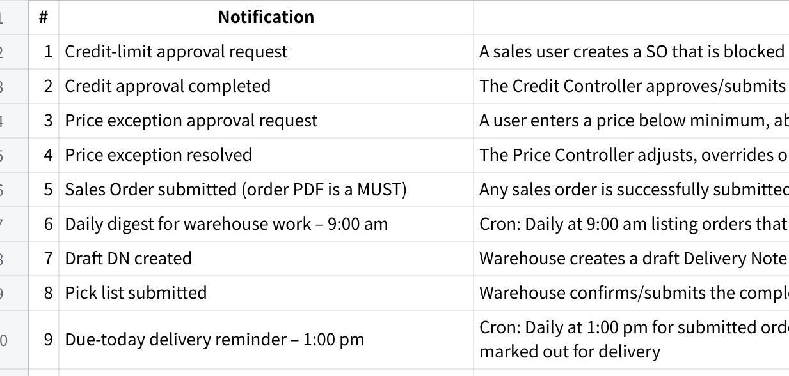

**Macrofrozen Notification**

**点击图片可查看完整电子表格**

**Common behaviour for every notification**

Every triggered notification should:

Be written into the relevant document's **Activity Trail**, including trigger, timestamp, actor/cron, recipients and outcome.

Be injected into the recipient's **MAIA chatbot**

Include a direct link to the relevant document.

Attach the PDF where operationally required: Sales Order, Delivery Order

Avoid duplicate alerts to the same person.

Record whether delivery succeeded or failed.

Close approval loops by notifying the original requestor after action is taken.

Things to clarify with clients about the notification

macrofrozen total sales using invoice or so?

need to include the return (CN) or deduct it?

revenue should belong to whom (assignee or owner)?
