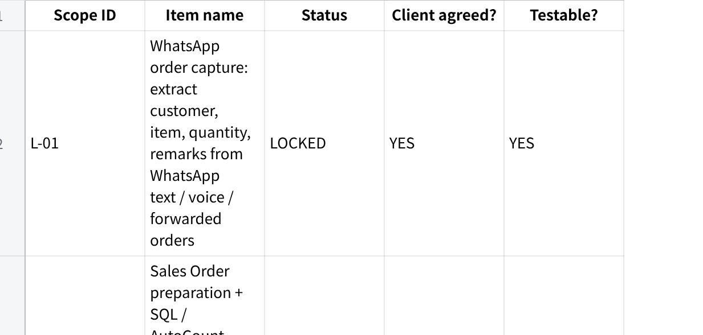
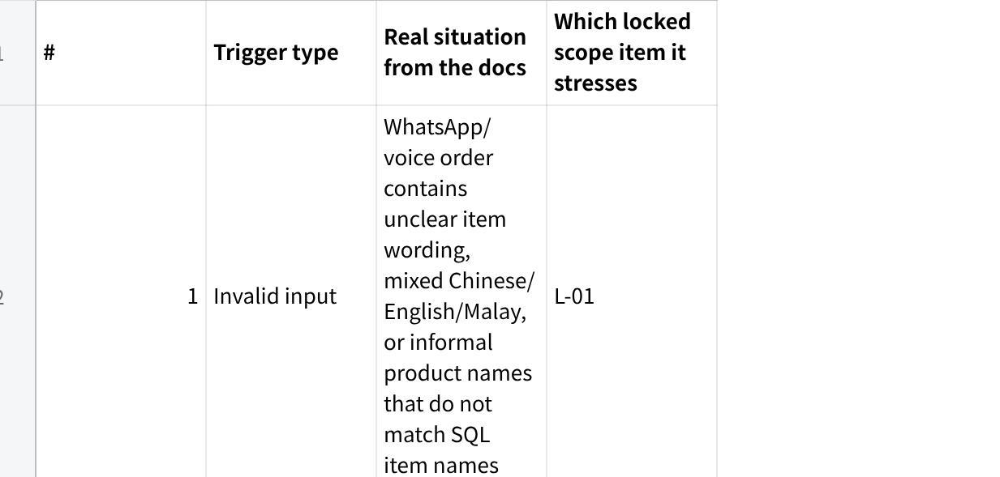
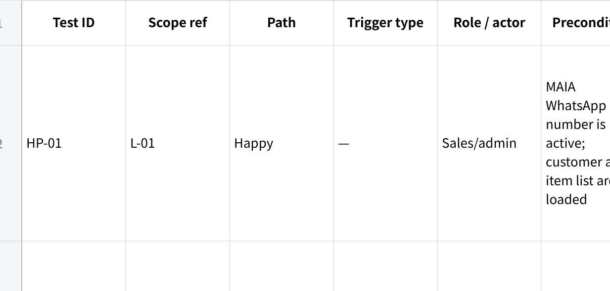
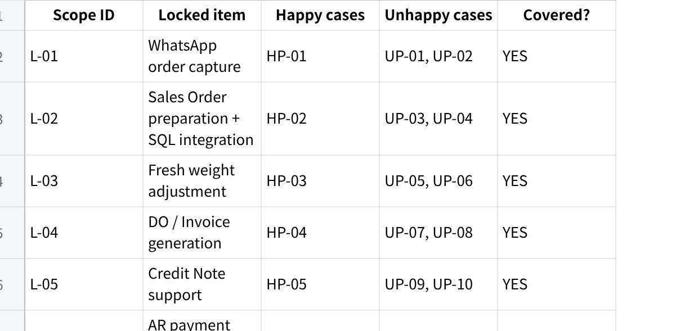
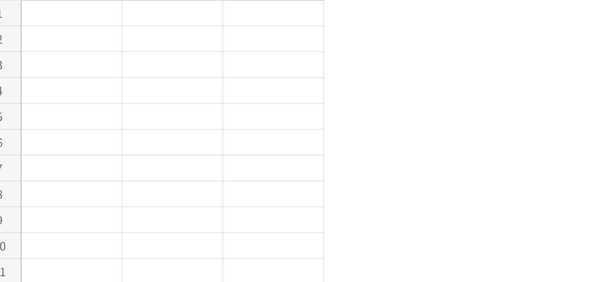

**UAT Checklist**

MISSING SOURCE: SCOPE_LOCK

MISSING SOURCE: FORENSIC_ACCOUNT_DOSSIER

Scope note: no separately labelled Scope Lock was provided. I used the signed proposal PDF/page images plus the \[REQ\] Macro Frozen Customer Narrative Document in-scope / out-of-scope sections as the conservative working scope source. Anything unclear is marked **not testable**. The working scope basis is: Base MAIA items, recommended customisations, and stated boundaries in the narrative; meeting notes corroborate SQL as master for customer/item data, MAIA as pricing source, Phase 1 core first, AR/price/catalogue customisations later, and delivery/WMS/AP items outside Phase 1.

**Step 1 --- Scope Inventory**

**点击图片可查看完整电子表格**

**Step 2 --- Unhappy-Path Bank**

The unhappy paths below come from the real workflow: WhatsApp/manual interpretation, weight changes after picking, payer-name mismatch, monthly/market-driven price changes, customer-group pricing, "one invoice" credit discipline, sales rep visibility rules, and explicit must-not boundaries.

**点击图片可查看完整电子表格**

**Step 3 --- UAT Checklist**

**点击图片可查看完整电子表格**

**Step 4 --- Coverage & Traceability Check**

**4a. Traceability --- every locked item is covered**

**点击图片可查看完整电子表格**

**4b. Excluded --- not tested, and why**

**点击图片可查看完整电子表格**

**4c. Assumptions & gaps**

**点击图片可查看完整电子表格**

**Final self-check**

**点击图片可查看完整电子表格**
