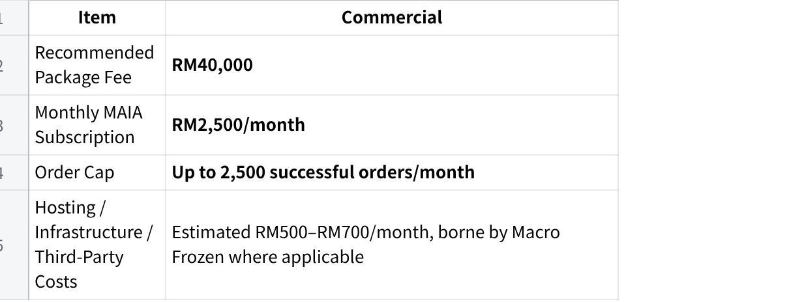
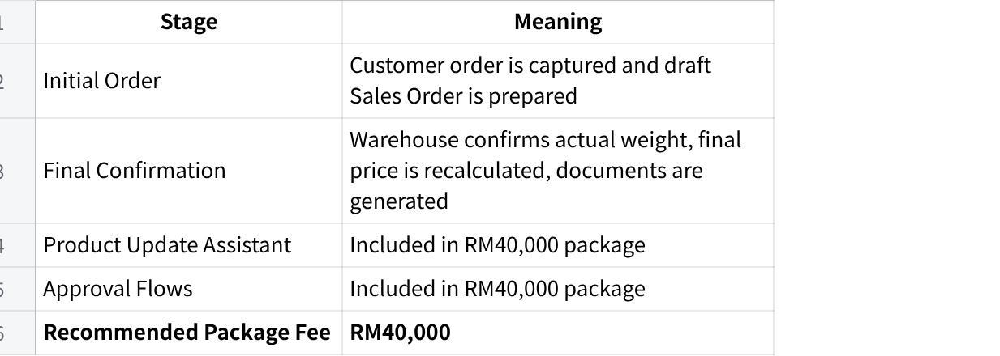

**\[REQ\] Macro Frozen Customer Narrative Document**

1.1 **Purpose of This Document**

This document provides the product and implementation team with the full client context needed to take over Macro Frozen after sales handover.

It combines:

What was discussed during the meeting

The latest commercial and proposal direction

The boss's key requested workflows

Product and implementation notes

Scope boundaries to prevent uncontrolled expansion

Risks and recommended handling during implementation

Important clarification: Macro Frozen uses **SQL / AutoCount-related accounting workflow** as their core accounting, order, customer, item, stock, and payment reference system. Product team should confirm the exact system and integration method during kickoff. MAIA should act as the operational assistant layer on top of the client's system, not replace it.

**Client-Facing Entity Instruction**

For this project, the client-facing company is **AutorunBiz PLT**.

Product, implementation, and meeting teams must handle all client-facing communication as **AutorunBiz PLT x MAIA**.

Important internal instruction:

Do not mention Mindhive in Macro Frozen meetings.

Do not use Mindhive-branded materials in client-facing meetings.

Do not wear Mindhive-branded shirts when attending Macro Frozen meetings.

Client-facing documents, follow-ups, and discussions should refer to **AutorunBiz PLT**, not Mindhive.

Recommended wording in meetings:

  ---------------------------------------------------------------------------------
  "We from AutorunBiz will be working with your team on the MAIA implementation."

  ---------------------------------------------------------------------------------

Avoid saying:

  --------------------------------------------------------------
  "We from Mindhive..."

  --------------------------------------------------------------

2\. **Client Snapshot**

**Client Name**

Macro Frozen / Macro Food

For client-facing materials, use:

**Macro Frozen**

**Industry**

Food distribution / frozen food / meat-related distribution.

**Current System**

SQL / AutoCount-related accounting and order workflow to be confirmed during kickoff.

**Current Order Channel**

Mainly WhatsApp.

**WhatsApp Setup**

Macro Frozen will only have **one WhatsApp number** that everyone uses to forward messages into MAIA.

Product team does not need to design for multiple WhatsApp numbers unless separately raised and approved.

**Estimated Order Volume**

Approximately **700 orders/month**.

**Commercial Structure**

The commercial structure for Macro Frozen is:

**点击图片可查看完整电子表格**

The RM40,000 package should be treated as the commercial structure for product handover. Product team should not discuss older pricing figures with the client. If commercial questions come up, route them back to Jeremy / sales owner.

**One-Line Snapshot**

Macro Frozen is a WhatsApp-heavy frozen food / meat distributor using SQL / AutoCount-related workflows, where the main operational issues are manual order entry, fresh weight adjustment, AR/payment slip and bank statement processing, price updates, product catalogue generation, simple warehouse stock entry, and approval control.

3\. **Business Context**

Macro Frozen operates in the food / frozen food distribution business. Customers place orders through WhatsApp, and the internal team manually interprets these orders before creating the required records/documents in their accounting/order system.

This client's workflow is not a simple "customer order → invoice" flow. Because they deal with weight-based products, the customer may order first, but the final actual weight and final amount may only be confirmed after warehouse preparation, cutting, packing, or weighing.

Product team should understand that the project is not only order automation. It involves:

WhatsApp order extraction

Sales Order creation

Fresh weight adjustment before final document generation

AR-related payment slip and bank statement processing

Outdoor sales query support

Bulk price update management

Product catalogue / product update image generation

Simple stock entry through chatbot or GRN photo

Approval controls for business exceptions

4\. **Current As-Is Workflow**

**4.1 High-Level Current Flow**

Current flow is likely:

Customer places order through WhatsApp.

Sales/admin staff manually reads the order.

Staff checks customer, item, quantity, price, and outstanding information.

Staff manually creates or updates the order in the accounting/order system.

Warehouse prepares/cuts/packs/weighs the goods.

Actual weight may differ from the initial order quantity.

Staff updates final weight and price.

DO / invoice / related document is generated.

Customer submits payment slip or payment is checked through bank statement.

Finance/admin manually matches payment to customer/invoice.

Payment status and outstanding balance are updated.

**4.2 Important Operating Detail**

Product team must pay close attention to the fresh weight workflow.

Macro Frozen may not know the final invoice amount at the point of initial order capture. The system must support a two-stage workflow:

**点击图片可查看完整电子表格**

MAIA should not assume every order can immediately become a final invoice.

5\. **Main Pain Points**

**5.1 Manual WhatsApp Order Processing**

Orders come in via WhatsApp and need to be manually interpreted. This creates delays and risk of incorrect item, quantity, customer, or price.

**5.2 Fresh Weight Adjustment**

Final weight and final price may only be known after warehouse preparation. This creates extra manual work and requires staff to update the order before final invoicing.

**5.3 AR / Payment Slip and Bank Statement Processing**

The boss specifically wants an **AR-related workflow/module** to process payment slips and bank statements.

Product instruction:

Macro Frozen should follow MAIA's existing AR/payment workflow as much as possible. Product team should **not customize the AR workflow heavily around Macro Frozen's current manual process** unless separately approved.

Product interpretation:

This should be handled as an **AR Support Workflow**, focused on:

Reading payment slips

Reading bank statement records

Extracting payer name, amount, date, and reference

Suggesting invoice/customer matching

Flagging unclear payer/customer mismatches

Letting users choose the correct customer/company before updating the accounting/order system

Do not build this as a fully autonomous finance system unless separately scoped.

**5.4 Warehouse Stock Entry Is Difficult for Their Team**

The boss wants stock entry to be simple and fast because inventory needs to be updated quickly. Their concern is that if stock is not updated, orders may be blocked from being keyed in due to insufficient inventory.

Important internal note: the warehouse person was described as quite "blur" and "slow." Product team should design this flow to be extremely simple, guided, and confirmation-based.

Preferred product approach:

  -----------------------------------------------------------------------------------------------------
  Warehouse user takes a picture of the GRN, and MAIA reads the GRN to create/update the stock entry.

  -----------------------------------------------------------------------------------------------------

Fallback approach:

  ---------------------------------------------------------------------------------------------------------------------
  A simple WhatsApp-based stock key-in flow where the warehouse user can quickly update stock through guided prompts.

  ---------------------------------------------------------------------------------------------------------------------

The goal is to make it fast and easy for warehouse to update inventory so order processing is not blocked by insufficient stock.

**5.5 Price Changes Need a Structured Process**

The client needs a way to update prices efficiently. Price changes should not rely on manual memory or scattered WhatsApp messages.

The Price Update Assistant should allow them to bulk update item prices using a MAIA-provided template.

**5.6 Product Updates / Catalogue Generation**

The client wants Product Update Assistant to generate an image / catalogue-style output.

Important product note:

This was committed during the sales conversation to close the deal. Product team should try to make this as standardized as possible.

The boss wanted this because plain message format is hard for his customers to read. He wants a more visual catalogue-style image that can be sent to customers.

Preferred product approach:

Use a fixed catalogue/image template.

Keep the layout consistent.

Update only text fields, item names, prices, stock status, and product details each time.

Use provided product images where available.

Avoid regenerating or redesigning a completely new image every time.

Let the Macro Frozen team review the image before sending.

Product team must clarify:

What template format the client will provide

What product fields are required

Whether product images are supplied by client

Whether MAIA generates one image, multiple images, or a PDF/catalogue page

Whether output is for WhatsApp forwarding

Whether there are brand/layout requirements

**5.7 Risk of Scope Creep**

The boss/team may try to include extra modules later.

Product team should be warned that the key discussed items are the ones listed in this narrative. Any additional module beyond the agreed scope should be routed back for separate commercial/scoping confirmation.

6\. **Products / Item Understanding**

Macro Frozen sells food / frozen food / meat-related products. Product data is important because the workflow depends heavily on:

Item matching

Unit of measurement

Weight-based quantity

Latest price

Stock availability

Product image/catalogue output

Product description

Carton/box information where applicable

**Product Data Required**

Product team should collect:

Item code / SKU

Item name

Item category

UOM

Standard price

Latest price

Weight rules if applicable

Stock availability source

Product images

Catalogue template

Product descriptions

Carton/box size or packaging details

Any customer-facing product name different from system item name

7\. **Customer Types and Buying Behavior**

Macro Frozen likely serves a mixture of customer types such as:

Wholesale customers

Retail customers

Food service / hawker / restaurant customers

Corporate or regular B2B customers

Smaller recurring customers

Product should focus on:

Correct customer identification

Correct order capture

Correct price based on latest price update

Outstanding/payment visibility

Approval rules where required

8\. **Order Intake Details**

**8.1 Order Formats**

Product should expect orders through:

WhatsApp text

WhatsApp voice notes

Informal customer messages

Forwarded customer orders from sales/admin staff

Potentially product names written differently from system item names

**8.2 Language Considerations**

Macro Frozen's team is more Chinese-speaking. Product and implementation team should be prepared to explain, clarify, and requirements-gather in Chinese where needed.

Product should expect:

Mandarin communication

Chinese-speaking users

Mixed English / Malay / Mandarin terms

Possibly Cantonese or Hokkien-style wording in voice notes or informal messages

Important:

Requirements gathering may need to be done partly in Chinese.

Training may need Chinese explanation.

Voice message interpretation should always require human review before submission.

Product should collect real examples of how the team/customer refers to items in Chinese or mixed language.

**8.3 WhatsApp Number Setup**

Macro Frozen will only use **one WhatsApp number** for the MAIA workflow.

All users/staff will forward or input messages through this one number. Product team does not need to design for multiple WhatsApp numbers unless this is separately raised and approved later.

Recommended Phase 1 setup:

One MAIA WhatsApp number

Authorized users forward/input customer orders into MAIA

MAIA processes the messages and creates the relevant workflow record

User reviews and confirms before submission

9\. **Systems and Tools**

**Current System**

SQL / AutoCount-related workflow to be confirmed during kickoff.

**MAIA Role**

MAIA should sit on top of the client's existing accounting/order system and act as the operational assistant layer.

MAIA should not replace the client's existing system.

**Important System Touchpoints**

MAIA may need to read/write or reference:

Customers

Items/SKUs

Pricing

Stock

Sales Orders

Delivery Order / Delivery Note

Invoice

Credit Note

Payment records

Outstanding balances

Product team must confirm the exact system access method during kickoff.

10\. **Proposed MAIA Role for This Client**

**10.1 Phase 1 Positioning**

MAIA should be treated primarily as an **internal operations assistant**, not a customer-facing ordering app.

The intended Phase 1 role:

Staff forwards or inputs WhatsApp orders into MAIA. MAIA extracts order details, checks customer/item/price/outstanding where data is available, prepares a draft Sales Order, supports fresh weight adjustment, helps process payment slips/bank statements, allows simple stock entry or GRN-based stock entry, and updates/creates records in the accounting/order system where technically supported.

**10.2 What MAIA Should Do in Phase 1**

MAIA should support:

WhatsApp order capture

Sales Order preparation

System integration where access allows

Fresh weight adjustment workflow

Delivery Order and invoice workflow

Payment slip processing

Bank statement processing

User-confirmed payment matching

Outdoor sales assistant queries

Customer information updates

GRN photo-based stock entry where feasible

Simple chatbot-based stock entry as fallback

**Price Update Assistant**

Product Update Assistant with standardized image/catalogue output

Approval Flows

Backend dashboard and reminders

11\. **Latest Recommended Scope and Commercials**

**11.1 Recommended Package Direction**

Based on the latest sales direction, the recommended package commercial structure for Macro Frozen is:

**点击图片可查看完整电子表格**

Important commercial note for product team:

The commercial structure to treat internally is **RM40,000**.

Product team should not discuss older package figures with the client.

If commercial questions come up, route them back to Jeremy / sales owner.

Product team should focus on confirming scope, workflow, data, UAT, and implementation feasibility.

**11.2 Monthly Subscription**

**点击图片可查看完整电子表格**

**11.3 Hosting / Third-Party Costs**

Hosting, infrastructure, WhatsApp API, AI usage, SQL vendor charges, and third-party platform fees are estimated at approximately **RM500--RM700/month** and are to be **borne by Macro Frozen where applicable**.

Do not word this as "charged separately."

12\. **In-Scope Items**

**12.1 Base MAIA**

The following should be treated as Base MAIA scope:

WhatsApp order capture

Sales Order preparation

System integration where access allows

Fresh weight adjustment workflow

Delivery Order and invoice workflow

Credit Note support

AR support workflow for payment slip and bank statement processing

Payment discrepancy review by user

Outdoor sales assistant

Customer information updates

Backend dashboard and daily reminders

**12.2 Recommended Customizations**

The latest recommended customizations are:

**点击图片可查看完整电子表格**

Important note: if GRN photo/simple stock entry is not currently priced separately, product/sales must clarify whether it is part of Base MAIA, part of customization, or needs separate pricing.

13\. **Out-of-Scope / Communicated Boundaries**

Product team should be aware that Macro Frozen's boss/team may try to include more modules later.

The correct handling is:

  ----------------------------------------------------------------------------------------------------
  "This is outside the current confirmed scope. We can document it for Phase 2 or separate scoping."

  ----------------------------------------------------------------------------------------------------

Out-of-scope unless separately approved:

Full ERP replacement

Full B2C customer ordering app

Customer-facing ordering chatbot

Fully automated WhatsApp broadcast/blasting

Full warehouse management system

Full inventory forecasting

Procurement recommendation / auto-purchasing

Complex multi-level approval matrix beyond agreed approval flows

Custom dashboards beyond agreed backend visibility

Additional finance modules beyond payment slip/bank statement AR support

Automatic payment alias mapping without user confirmation

Any additional module the boss/team raises after sign-off without commercial approval

14\. **Important Workflow Clarifications**

**14.1 AR Module Clarification**

The boss mentioned wanting an **AR module**, mainly to process payment slips and bank statements.

Important product instruction:

Macro Frozen should follow MAIA's existing AR/payment workflow as much as possible. Product team should **not customize the AR workflow heavily around Macro Frozen's current manual process** unless separately approved.

The AR support workflow should follow our standard MAIA approach:

User uploads or forwards payment slip / bank statement.

MAIA extracts amount, payer name, reference, and date.

MAIA suggests a matching customer/invoice where possible.

If payer name or reference is unclear, MAIA flags it for review.

User selects the correct customer/company.

User confirms the payment match.

MAIA updates the payment record / system where integration allows.

Key principle:

  ---------------------------------------------------------------------------------------------------------------------------------------------
  Macro Frozen should adapt to MAIA's standard AR/payment matching workflow, instead of product custom-building a unique AR process for them.

  ---------------------------------------------------------------------------------------------------------------------------------------------

Do not interpret this as a full custom finance AR system unless separately scoped.

**14.2 Stock Entry Clarification**

The boss wants warehouse stock entry to be simple because inventory needs to be updated quickly. Their concern is that if stock is not updated, orders may be blocked from being keyed in due to insufficient inventory.

The preferred approach is:

  -----------------------------------------------------------------------------------------------------
  Warehouse user takes a picture of the GRN, and MAIA reads the GRN to create/update the stock entry.

  -----------------------------------------------------------------------------------------------------

If GRN image processing is not feasible in Phase 1, the fallback approach is:

  ---------------------------------------------------------------------------------------------------------------------
  A simple WhatsApp-based stock key-in flow where the warehouse user can quickly update stock through guided prompts.

  ---------------------------------------------------------------------------------------------------------------------

Important internal note:

The warehouse user may be slow / blur, so the flow must be extremely simple, guided, and confirmation-based.

Recommended GRN photo flow:

Warehouse user takes a picture of the GRN.

User sends it to MAIA through WhatsApp.

MAIA extracts item, quantity, UOM, supplier/reference where available.

MAIA shows a stock entry summary.

User confirms or corrects.

MAIA updates stock entry / stock movement where integration allows.

Fallback WhatsApp key-in flow:

User says: "Add stock"

MAIA asks for item

MAIA asks for quantity / weight

MAIA asks for warehouse/location if needed

MAIA asks for reference/reason

MAIA shows summary

User confirms

MAIA updates stock where integration allows

Key goal:

  -------------------------------------------------------------------------------------------------------------------
  Make it fast and easy for warehouse to update inventory so order processing is not blocked by insufficient stock.

  -------------------------------------------------------------------------------------------------------------------

Do not build this as a full WMS unless separately scoped.

**14.3 Product Catalogue / Product Update Assistant Clarification**

The Product Update Assistant was committed during the sales conversation to help close the deal. Product team should try to make this as standardized as possible.

The boss wants this because plain message format is hard for his customers to read. He wants a more visual catalogue-style image that can be sent to customers.

Important product instruction:

Product team should avoid building a fully custom image-generation workflow for every request. The preferred approach is to standardize the catalogue/image format as much as possible.

Recommended approach:

Use a fixed catalogue/image template

Keep layout consistent

Update only text fields, item names, prices, stock status, and product details each time

Use provided product images where available

Avoid regenerating a completely new design every time

Let the Macro Frozen team review the image before sending

Product team should clarify:

What catalogue template the client will provide

Whether template is image, Canva, PDF, PSD, AI, PowerPoint, or other format

Required product fields

Number of products per image/page

Whether product images are provided

Whether output should be image, PDF, or WhatsApp-ready visual

Whether prices should come from Price Update Assistant

Whether only in-stock items should be included

Recommended flow:

Macro Frozen updates latest price / product data.

User asks MAIA to generate product catalogue update.

MAIA uses standardized catalogue template.

MAIA updates text, price, and product fields.

MAIA generates image/catalogue output.

User reviews.

User manually forwards to customers.

Boundary:

Do not promise fully automated WhatsApp blasting. MAIA generates the catalogue output; Macro Frozen reviews and sends manually unless separately scoped.

15\. **Payment and Finance Flow**

**15.1 What Was Discussed**

The boss wants MAIA to help with AR-related processes, specifically payment slip and bank statement handling.

Expected flow:

Customer sends payment slip or finance uploads bank statement.

MAIA reads amount, payer name, reference, and date.

MAIA suggests matching invoice/customer.

If the payer name is unclear or different from customer name, MAIA does not auto-map.

User selects correct customer/company.

User confirms.

MAIA updates payment record / system where integration allows.

Dashboard reflects updated payment status.

**15.2 Product Boundary**

MAIA should not automatically decide unclear payer aliases.

Safe Phase 1 principle:

  --------------------------------------------------------------
  Suggest, flag, and ask user to confirm.

  --------------------------------------------------------------

16\. **Credit Control**

Credit/outstanding visibility is relevant because salespeople may need to check whether a customer has outstanding amounts before confirming orders.

Product team should support:

Checking customer outstanding where data is available

Showing outstanding/payment status to authorized users

Flagging exceptions where payment/outstanding issue requires approval

Routing approval if configured

Do not create a full credit scoring engine unless separately scoped.

17\. **Stock, Warehouse, Picking, and Fulfillment**

**17.1 What Was Discussed**

The boss wants easy inventory updates so stock can be updated quickly and does not block orders from being keyed in due to insufficient inventory.

Preferred approach:

Warehouse takes a photo of GRN.

MAIA extracts stock entry details.

User confirms.

Stock is updated where integration allows.

Fallback approach:

Warehouse keys in stock through a simple WhatsApp-guided flow.

**17.2 Product Recommendation**

Build the stock entry flow as:

Guided

Step-by-step

Confirmation-based

Low typing burden

Clear item/quantity summary before submission

Permission-controlled

Designed for a non-technical warehouse user

**17.3 Product Boundary**

This is not the same as building a full WMS.

Do not include unless separately approved:

Bin-level warehouse management

Picker app

Route planning

Advanced stock forecasting

Full warehouse optimization

Barcode scanning unless explicitly scoped

Inventory counting/cycle count workflows unless confirmed

18\. **Product / Catalogue Update Flow**

**18.1 What Was Discussed**

Macro Frozen wants to be able to generate product update visuals/images, likely to send to customers.

The client will provide a template of the catalogue.

This was promised during sales to close the deal, so product team should find the most standardized and controlled way to deliver it.

**18.2 Expected Product Update Assistant Flow**

Macro Frozen updates product/price/stock data.

User asks MAIA to generate product update catalogue.

MAIA pulls current items, prices, and stock availability.

MAIA uses client-provided or standardized catalogue template.

MAIA updates the text/product/price fields into the template.

MAIA generates image/catalogue output.

User reviews output.

User manually sends to customers.

**18.3 Boundary**

Do not promise fully automated WhatsApp blasting.

MAIA should generate the catalogue image/output, but the team manually reviews and forwards unless automated sending is separately approved and technically/policy-wise allowed.

19\. **Multi-WhatsApp Number Situation**

Macro Frozen will only have **one WhatsApp number** that everyone uses to forward messages.

Product interpretation:

Do not design around multiple WhatsApp numbers in Phase 1.

Use one MAIA assistant number.

Authorized staff forward/input messages to that number.

MAIA records and processes the workflow through that number.

Any multi-number or multi-inbox workflow should be treated as separate scope if raised later.

20\. **Customer-Facing vs Internal-Facing**

This project should be internal-facing first.

Do not position MAIA as a customer-facing ordering chatbot or B2C ordering app in Phase 1.

Reason:

The immediate bottleneck is internal operations after receiving the order:

Interpreting order

Keying into the system

Adjusting weight

Generating documents

Updating payment

Updating stock

Generating product catalogue

21\. **Quotation / Sales Documents**

Outdoor sales may need to generate customer-facing documents on the go.

Based on previous discussion, the important documents are likely:

Sales Order

Delivery Order / Delivery Note

Invoice

Proforma Invoice where required

Credit Note where applicable

Payment receipt/payment record where applicable

Product team should verify during kickoff whether Macro Frozen actually uses quotation regularly, or whether invoice/proforma invoice is the more relevant document.

22\. **Hosting / Deployment**

Hosting, infrastructure, WhatsApp API, AI usage, SQL vendor charges, and third-party platform fees are to be borne by Macro Frozen where applicable.

Product team must clarify during kickoff:

Where MAIA will be hosted

Who owns cloud account

Whether the accounting/order system is cloud or local

Whether VPN/access is required

Who coordinates the system vendor

WhatsApp API provider and ownership

Any vendor charges required for integration

Do not describe these costs as "charged separately" in client-facing documents. Use:

  --------------------------------------------------------------
  "Borne by Macro Frozen where applicable."

  --------------------------------------------------------------

23\. **Data Required Before Build**

**Customer Data**

Product team should collect:

Customer list

Customer code

Customer company name

Contact person

Phone number

Billing address

Delivery address

Outstanding balance

Credit/payment terms where applicable

**Item Data**

Product team should collect:

SKU/item code

Item name

UOM

Selling price

Latest price

Stock quantity

Product category

Product image

Product description

Carton/box information

**Pricing Data**

Product team should collect:

Current price list

Price update template requirements

Price change frequency

Any approval required for price override

**Payment Data**

Product team should collect:

Sample payment slips

Sample bank statement

Common payer name mismatch examples

Invoice/payment matching rules

**Warehouse / Stock Data**

Product team should collect:

Sample GRNs

GRN formats

Stock entry scenarios

Warehouse/location list

Item stock adjustment reasons

User permissions

Current stock update process

**Product Catalogue Data**

Product team should collect:

Catalogue template

Product image assets

Fields to display

Branding / layout requirements

Output format

Number of products per image/page

Examples of current product messages that customers find hard to read

**Documents**

Product team should collect:

Sales Order sample

DO / Delivery Note sample

Invoice sample

Proforma Invoice sample

Credit Note sample

Payment receipt/payment record sample

24\. **Suggested UAT Scenarios**

**Scenario 1: WhatsApp Order to Sales Order**

Staff forwards customer WhatsApp order.

MAIA extracts customer, item, quantity, remarks.

Staff reviews draft.

MAIA creates/updates Sales Order where integration allows.

**Scenario 2: Fresh Weight Adjustment**

Initial order is created.

Warehouse updates actual weight.

MAIA recalculates final amount.

Staff confirms.

DO/invoice is generated.

**Scenario 3: Payment Slip Matching**

Customer sends payment slip.

MAIA extracts amount/date/reference/payer name.

MAIA suggests match.

User confirms.

Payment record is updated.

**Scenario 4: Bank Statement Matching**

Finance uploads bank statement.

MAIA reads transactions.

MAIA suggests matching customers/invoices.

Unclear items are flagged.

User selects correct customer/company.

**Scenario 5: Payer Name Discrepancy**

Payment comes from a different payer name.

MAIA does not auto-map.

MAIA asks user to choose correct company.

User confirms before system update.

**Scenario 6: GRN Photo Stock Entry**

Warehouse user takes photo of GRN.

User sends it to MAIA.

MAIA extracts item, quantity, UOM, and reference where available.

MAIA shows confirmation summary.

User confirms.

Stock entry is created/updated where integration allows.

**Scenario 7: Simple Chatbot Stock Entry**

Warehouse user enters stock through chatbot.

MAIA asks guided questions.

MAIA shows summary.

User confirms.

Stock entry is created/updated where integration allows.

**Scenario 8: Price Update Assistant**

User uploads MAIA price update template.

MAIA validates and updates latest prices.

User queries latest item price.

Sales Order uses latest price.

**Scenario 9: Product Update Assistant**

User asks MAIA to generate product catalogue update.

MAIA uses client-provided or standardized template.

MAIA updates text/product/price fields.

MAIA generates image/catalogue output.

User reviews and manually sends to customers.

**Scenario 10: Approval Flow**

Order hits approval condition.

MAIA routes to approver.

Approver approves/rejects.

Order proceeds only after approval.

**Scenario 11: Outdoor Sales Query**

Salesperson asks MAIA for price/outstanding/customer info.

MAIA retrieves available data.

Salesperson requests proforma invoice/invoice where required.

**Scenario 12: Chinese-Speaking User Training / Requirement Confirmation**

Product team confirms workflow with Chinese-speaking users.

User explains item names/order terms in Chinese or mixed language.

Product team captures real examples for configuration/training.

25\. **Key Risks for Product Team**

**Risk 1: Scope Creep From Boss / Team**

The boss or team may try to include additional modules during implementation.

Recommended handling:

  ----------------------------------------------------------------------------------------------------
  "This is outside the current confirmed scope. We can document it for Phase 2 or separate scoping."

  ----------------------------------------------------------------------------------------------------

**Risk 2: AR Workflow Over-Customization**

Macro Frozen may expect the AR workflow to follow their current manual process exactly.

Product handling:

  -------------------------------------------------------------------------------------------------------------------------------------------------------------------------
  Product team should guide Macro Frozen to follow MAIA's existing AR/payment matching workflow. Any heavy customization to AR logic should be treated as separate scope.

  -------------------------------------------------------------------------------------------------------------------------------------------------------------------------

**Risk 3: Warehouse User Adoption**

Warehouse staff may be slow/blur and may struggle with complex systems.

Product handling:

  ----------------------------------------------------------------------------------------------
  Design GRN photo capture and WhatsApp stock entry as guided, simple, and confirmation-based.

  ----------------------------------------------------------------------------------------------

**Risk 4: GRN Photo Reading Accuracy**

If warehouse users upload photos of GRNs, quality may vary.

Product handling:

  ------------------------------------------------------------------------------------------------------------------------
  MAIA should extract what it can, then show a confirmation summary. Do not auto-update stock without user confirmation.

  ------------------------------------------------------------------------------------------------------------------------

**Risk 5: Product Catalogue Becomes Too Custom**

The catalogue/image generation was promised to close the deal, but product team should standardize the format as much as possible.

Product handling:

  --------------------------------------------------------------------------------------------------------------------------
  Use one reusable template and update text/product/price fields. Avoid custom-designing a new catalogue image every time.

  --------------------------------------------------------------------------------------------------------------------------

**Risk 6: Chinese-Speaking User Adoption**

Macro Frozen's team may be more comfortable in Chinese.

Product handling:

  ----------------------------------------------------------------------------------------------
  Be ready to requirements-gather, explain workflows, and train users in Chinese where needed.

  ----------------------------------------------------------------------------------------------

**Risk 7: SQL / AutoCount Integration Dependency**

Implementation depends on system access, vendor cooperation, and available integration method.

**Risk 8: Payment Matching Accuracy**

Payment slips and bank statement matching may be imperfect when payer names differ. System must require user confirmation for unclear matches.

**Risk 9: Voice Order Accuracy**

If the client uses voice notes, accuracy depends on audio quality, language, dialect, and pronunciation. Human review is required.

**Risk 10: Brand / Entity Confusion**

This project must be handled client-facing as **AutorunBiz PLT**, not Mindhive.

Product and implementation team must avoid:

Mentioning Mindhive in meetings

Wearing Mindhive-branded shirts

Using Mindhive-branded slides or documents

Referring to "Mindhive team" in client communication

26\. **Product Team Recommendation**

Implement Phase 1 as a **WhatsApp-to-system operational assistant** with AR support, simple warehouse stock entry, price updates, product catalogue generation, and approval controls.

Recommended Phase 1 build focus:

Message-to-order workflow

Fresh weight adjustment workflow

Sales Order / DO / invoice flow

Standard MAIA AR/payment slip and bank statement workflow

User-confirmed payment discrepancy handling

Outdoor sales assistant

GRN photo-based stock entry where feasible

Simple chatbot-based stock entry as fallback

Price Update Assistant

Product Update Assistant with standardized catalogue image generation

Approval Flows

Backend dashboard and reminders

Do not build Phase 1 as a full ERP, custom AR finance suite, full WMS, customer-facing app, multi-WhatsApp inbox system, or automated WhatsApp broadcast system.

27\. **One-Line Product Summary**

Macro Frozen is a food / frozen food distributor using SQL / AutoCount-related workflows and WhatsApp-heavy operations. Phase 1 should help internal staff convert WhatsApp orders into structured Sales Orders, support fresh weight adjustment before final invoicing, process payment slips and bank statements using MAIA's standard AR support workflow, allow easy stock entry through GRN photo capture or simple WhatsApp key-in, support bulk price updates, generate standardized catalogue-style product update images using a client-provided template, and route exception cases through approval flows. Product team should be prepared to requirements-gather and train in Chinese, handle the project client-facing as AutorunBiz PLT, and route any additional module requests for separate scoping and approval.
