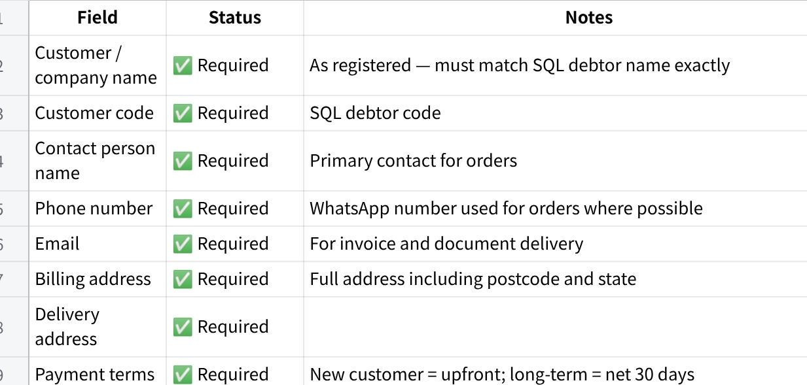
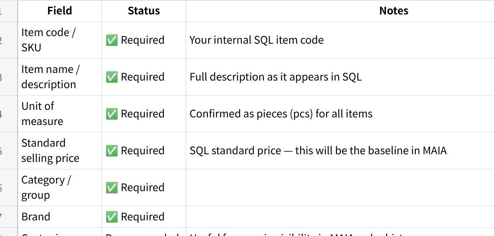
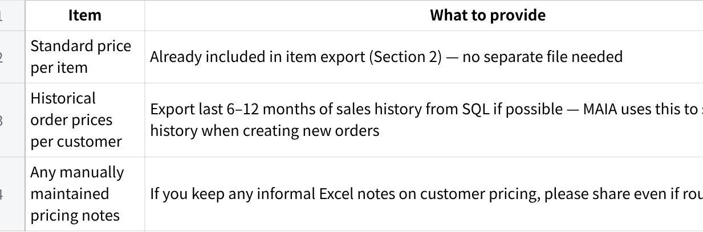
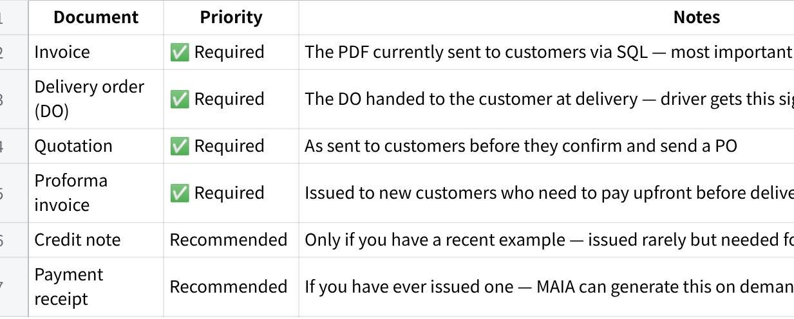
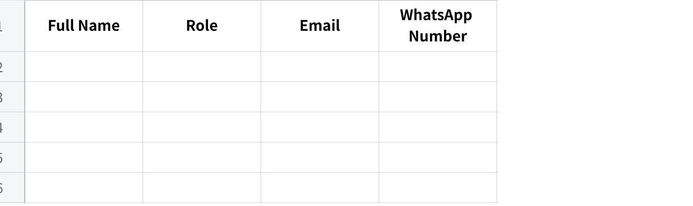

**\[Survey\] Macro Frozen Food Sdn Bhd - Doc Checklist**

**MAIA by Mindhive --- Sample Data Checklist**

**Prepared after requirements meeting --- 4 June 2026**

**点击图片可查看完整电子表格**

+:---------------------------------------------------------------------------------------------------------------------------------------------------------------------------------------------------------------------------------------------------------------------------------------------------------------------------------------------------------------+
| **Why we need this** To configure MAIA correctly for your business, we need to see your real data. We use these files to understand your customer structure, item naming conventions, pricing approach, and document formats. Do not worry if the data is messy or incomplete --- send what you currently have. It is always better to review real data early. |
|                                                                                                                                                                                                                                                                                                                                                                |
| ⚠️ **Important:** Based on our meeting on 22 May 2026, your main data source is SQL. Please export files directly from SQL rather than re-typing them. Your accountant should be able to assist. Do not send SQL login credentials, passwords, or API keys in this submission.                                                                                 |
+----------------------------------------------------------------------------------------------------------------------------------------------------------------------------------------------------------------------------------------------------------------------------------------------------------------------------------------------------------------+

m

1\. **Customer Database Export**

**Source: SQL debtor maintenance --- export full table as Excel or CSV**

  -------------------------------------------------------------------------------------------------------------------------------------------------------------------------------------------------------------------------------
  📋 **From the meeting:** You confirmed all customer records are in a single debtor maintenance table in SQL. There is no separate invoicing customer table. Your accountant manages this data and can assist with the export.

  -------------------------------------------------------------------------------------------------------------------------------------------------------------------------------------------------------------------------------

**点击图片可查看完整电子表格**

**Sample size:** Export all active customers. Include inactive customers in a separate tab or with a flag column. Include edge cases: missing contact info, multiple delivery addresses, special pricing arrangements.

2\. **Product / Item Database Export**

**Source: SQL item master --- export full table as Excel or CSV**

  ------------------------------------------------------------------------------------------------------------------------------------------------------------------------------------------------------------------------------------------------------------------------------------
  📋 **From the meeting:** Single UOM per SKU confirmed (pieces only --- no carton/pack variants). No bundle or kit products. Items span a broad range of industrial hardware across many brands. The full item list must be exported before MAIA can be configured for SKU mapping.

  ------------------------------------------------------------------------------------------------------------------------------------------------------------------------------------------------------------------------------------------------------------------------------------

**点击图片可查看完整电子表格**

**Sample size:** Export all active items --- the full item master is needed. Include discontinued items in a separate tab. Include edge cases: items with very similar names or codes that are easy to confuse.

3\. **Pricing Data**

**Note: simplified based on meeting --- no formal price list exists**

**点击图片可查看完整电子表格**

  -----------------------------------------------------------------------------------------------------------------------------------------------------------------------------------------------------------------------------------------------------------------------------------
  💡 **Going forward:** Once MAIA is live, the system will maintain a customer price table per item. You confirmed during the demo that you are happy to use this feature. Prices will be set per customer as orders are confirmed, and MAIA will auto-apply them on repeat orders.

  -----------------------------------------------------------------------------------------------------------------------------------------------------------------------------------------------------------------------------------------------------------------------------------

4\. **Customer Purchase Orders (POs)**

**The most important input for SKU extraction and mapping training**

  ---------------------------------------------------------------------------------------------------------------------------------------------------------------------------------------------------------------------------------------------------------------------------------------------------------------------------------------------------------------------------------------------------------------------
  📋 **From the meeting:** Customers send POs in varying formats --- different companies use different item codes and descriptions that do not match your internal SKUs. Providing a large and varied set of real customer POs is the single most important step for training MAIA to do accurate extraction and SKU mapping. Target: **20 to 100 POs from as many different customers as possible. More is better.**

  ---------------------------------------------------------------------------------------------------------------------------------------------------------------------------------------------------------------------------------------------------------------------------------------------------------------------------------------------------------------------------------------------------------------------

**点击图片可查看完整电子表格**

+:-----------------------------------------------------------------------------------------------------------------+
| ⚠️ **How to collect these:**                                                                                     |
|                                                                                                                  |
| Check your WhatsApp chat history --- most customer POs arrive via WhatsApp. Screenshot or forward the originals. |
|                                                                                                                  |
| Check your email for any POs received by email.                                                                  |
|                                                                                                                  |
| Check any physical or scanned POs on file.                                                                       |
|                                                                                                                  |
| Do not clean or format them --- send as-is. Raw real documents are what we need.                                 |
+------------------------------------------------------------------------------------------------------------------+

5\. **Sample Transaction Documents**

**1 clean sample of each document type you actually send to customers**

**点击图片可查看完整电子表格**

  ----------------------------------------------------------------------------------------------------------------------------------------------------------------------------------------------------------------------------------
  💡 Send the PDF exactly as you send it to customers --- do not redact or reformat. We need to see the full layout including your company header, logo, all fields, and footer. One real example per document type is sufficient.

  ----------------------------------------------------------------------------------------------------------------------------------------------------------------------------------------------------------------------------------

6\. **Technical Setup Items**

**Actions required from your side to set up the MAIA infrastructure**

  ----------------------------------------------------------------------------------------------------------------------------------------------------------------------------------------------------------------------------------
  📋 **From the meeting:** Three technical accounts need to be created and shared with Mindhive before MAIA can be deployed. Gareth will share tutorial videos for each. Your accountant may be able to assist with the AWS setup.

  ----------------------------------------------------------------------------------------------------------------------------------------------------------------------------------------------------------------------------------

MAIA Set up Guide Document : [Macrofrozen - MAIA Setup Guide](https://eg69120xnei.sg.larksuite.com/wiki/FO1qw0AFWitzu4kf7Kcl9b2wgEc?from=from_copylink)

**点击图片可查看完整电子表格**

+:-------------------------------------------------------------------------------------------------------------------+
| ⚠️ **Security reminder:**                                                                                          |
|                                                                                                                    |
| Do not send your OpenAI API key, AWS credentials, or any passwords via WhatsApp or email.                          |
|                                                                                                                    |
| Store your OpenAI API key in a document saved on a USB drive or secured PC folder --- not in a chat or cloud note. |
+--------------------------------------------------------------------------------------------------------------------+

7\. **MAIA User List**

**Required to create user accounts and grant access to MAIA**

  --------------------------------------------------------------------------------------------------------------------------------------------------------------------------------------------------------------------------------------------------------------------------------------------------------------------------------------------------------------
  📋 **How MAIA recognises users:** MAIA identifies each person by the phone number they use to message the MAIA WhatsApp number. Only registered phone numbers are recognised --- if someone messages from an unregistered number, MAIA will not respond and access will be denied. This is by design to protect your business data from unauthorised access.

  --------------------------------------------------------------------------------------------------------------------------------------------------------------------------------------------------------------------------------------------------------------------------------------------------------------------------------------------------------------

Please provide the details below for every person who will use MAIA --- including sales coordinators and any managers who need visibility access.

**点击图片可查看完整电子表格**

+:------------------------------------------------------------------------------------------------------------------------------------------------------------------+
| ⚠️ **Important --- use personal numbers, not shared ones:**                                                                                                       |
|                                                                                                                                                                   |
| Each user must be registered with the phone number they personally use to message MAIA.                                                                           |
|                                                                                                                                                                   |
| If a user switches to a different phone or number later, they must notify Mindhive to update their registration --- otherwise MAIA will not recognise them.       |
|                                                                                                                                                                   |
| Do not register a shared office phone or company line as a user number. MAIA uses the number to identify the individual and apply the correct access permissions. |
+-------------------------------------------------------------------------------------------------------------------------------------------------------------------+

**Please fill in the table below and return it with your other data files:**

**点击图片可查看完整电子表格**

  ------------------------------------------------------------------------------------------------------------------------------------------------------------------------------------------------------------------------------------------------------------------------
  💡 Add or remove rows as needed. Based on our meeting, we expect at least: 2 sales coordinators and 1 manager / owner. If a person uses MAIA in more than one role (e.g. coordinator who also does deliveries), list them once and note both roles in the Role column.

  ------------------------------------------------------------------------------------------------------------------------------------------------------------------------------------------------------------------------------------------------------------------------

**Summary Checklist**

Tick off each item as you prepare it. Items marked ★ are blockers --- kickoff cannot proceed without them.

+:----------------------------------------------------------------------:+:-------------:+:----------------------:+:-----------------+
| **Data Item**                                                          | **Uploaded?** | **Estimated Ready By** | Storage location |
+------------------------------------------------------------------------+---------------+------------------------+------------------+
| Customer list (name, code, phone, address, credit terms, credit limit) | Done          |                        |                  |
+------------------------------------------------------------------------+---------------+------------------------+------------------+
| Item / SKU list (code, name, aliases, UOM, category, Standard price)   | Done          |                        |                  |
+------------------------------------------------------------------------+---------------+------------------------+------------------+
| User list and WhatsApp phone numbers (authorised MAIA users)           | Done          |                        |                  |
+------------------------------------------------------------------------+---------------+------------------------+------------------+
| Sample PDF Doc format (from sql )                                      | Done          |                        |                  |
|                                                                        |               |                        |                  |
| Quotation                                                              |               |                        |                  |
|                                                                        |               |                        |                  |
| Proforma invoice                                                       |               |                        |                  |
|                                                                        |               |                        |                  |
| Invoice                                                                |               |                        |                  |
|                                                                        |               |                        |                  |
| Delivery Order                                                         |               |                        |                  |
|                                                                        |               |                        |                  |
| Credit note                                                            |               |                        |                  |
+------------------------------------------------------------------------+---------------+------------------------+------------------+
| Product catalogue or brochure                                          | Done          |                        |                  |
+------------------------------------------------------------------------+---------------+------------------------+------------------+
| 3--5 sample real WhatsApp order messages (text)                        | Done          |                        |                  |
+------------------------------------------------------------------------+---------------+------------------------+------------------+
| 1--2 sample voice message orders (audio file)                          | Done          |                        |                  |
+------------------------------------------------------------------------+---------------+------------------------+------------------+
| 1--2 sample PO documents received from customers                       | Done          |                        |                  |
+------------------------------------------------------------------------+---------------+------------------------+------------------+

**Data exports**

\[ \] ★ Customer database export from SQL (debtor maintenance) --- Excel or CSV

\[ \] ★ Item / SKU list export from SQL (full item master with code, name, UOM, price, category, brand)

\[ \] ★ Customer PO samples --- 20 to 100 documents from different customers (all formats accepted)

\[ \] Historical order / sales history export from SQL --- last 6--12 months if possible (optional but valuable)

\[ \] Any informal Excel pricing notes per customer (optional)

**Sample documents**

\[ \] ★ 1 sample invoice (PDF as sent to customers via SQL)

\[ \] ★ 1 sample delivery order / DO (PDF handed to customer at delivery)

\[\] 1 sample quotation (PDF as sent to customers)

\[ \] 1 sample proforma invoice (for new customers requiring upfront payment)

\[ \] 1 sample credit note (if available)

\[ \] 1 sample payment receipt (if available)

**Technical setup**

\[ \] ★ New dedicated phone number obtained for MAIA\'s WhatsApp Business API

\[ \] ★ OpenAI account created and API key generated --- stored securely

\[ \] ★ AWS account created and payment method attached

\[ \] ★ Brendan introduced to your accountant (SQL dealer) for integration scoping

**Optional but helpful**

\[ \] Product catalogue or brochure (helps with product naming and positioning)

\[ \] Any sample WhatsApp order conversations (helps design the coordinator chat flow)

\[ \] Current SQL report samples (daily sales, AR aging, stock movement)
